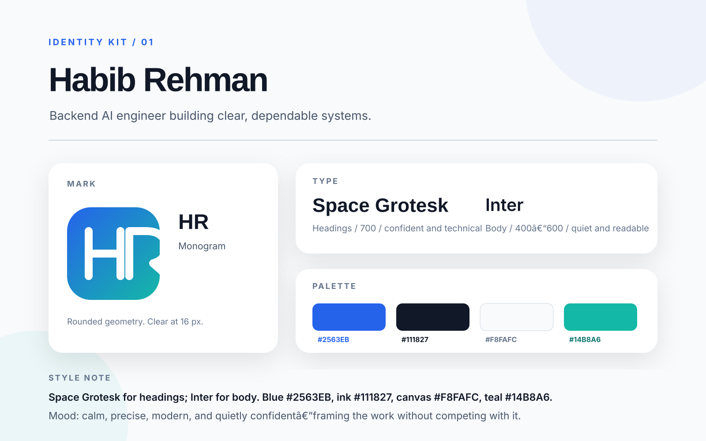

# Decide Once: Build Your Identity Kit

## Typography

- **Heading:** Space Grotesk, weight 700
- **Body:** Inter, weights 400-600

Both are free, open-source fonts available through Google Fonts.

## Palette

| Role | Color | Hex |
|---|---|---|
| Main | Clear blue | `#2563EB` |
| Text | Near-black ink | `#111827` |
| Background | Near-white canvas | `#F8FAFC` |
| Accent | Restrained teal | `#14B8A6` |

## Logo / favicon

The `HR` monogram combines rounded geometry with a blue-to-teal field. It stays recognizable at favicon size and avoids visual detail that would compete with portfolio work.

## Two-line style note

> Space Grotesk for headings; Inter for body. Blue `#2563EB`, ink `#111827`, canvas `#F8FAFC`, teal `#14B8A6`.  
> Mood: calm, precise, modern, and quietly confident - framing the work without competing with it.

## Reusable files

- [`identity-kit.svg`](identity-kit.svg) - one-page submission
- [`favicon.svg`](favicon.svg) - reusable logo/favicon
- [`STYLE-NOTE.md`](STYLE-NOTE.md) - copy-ready project style note

